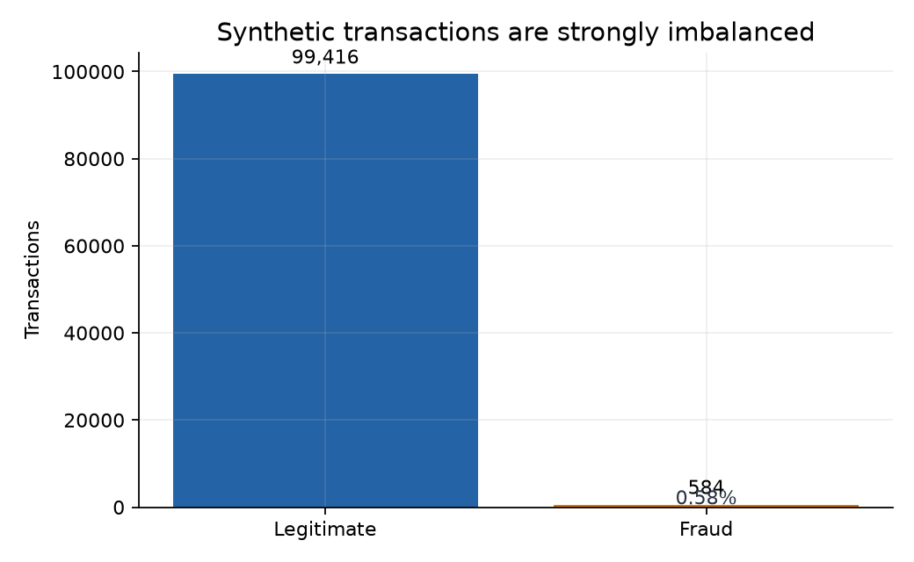
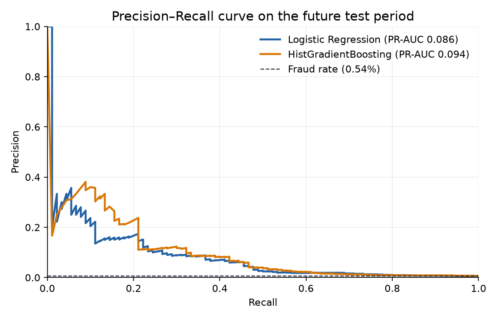
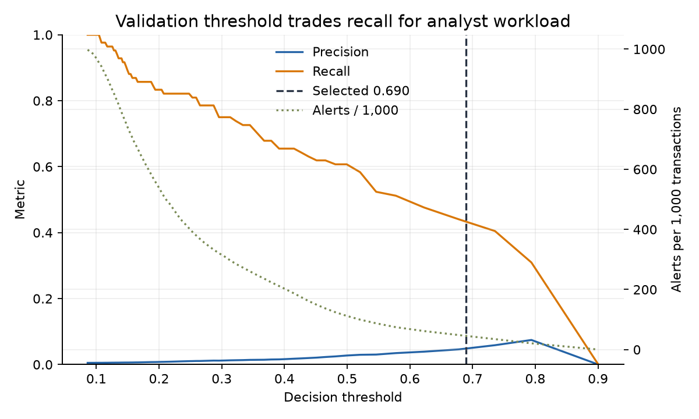
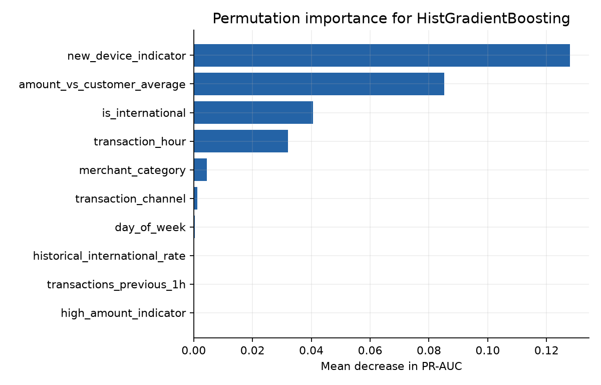

# Fraud Intelligence Agent

**Fraud Detection · Risk Scoring · Agentic RAG Investigation**

An intentionally simple interview case study showing how a fraud model can prioritize transactions and how a tool-driven investigation assistant can gather evidence, retrieve policy, and recommend human review.

> All customers, transactions, labels, and policies are synthetic. This project does not make autonomous financial decisions.

## The Core Story

| Layer | Question | Output |
|---|---|---|
| Machine learning | **How risky is this transaction?** | Probability and alert priority |
| Agentic RAG | **Why does this alert deserve investigation?** | Evidence, policy citations, recommendation |
| Human analyst | **What action should we actually take?** | Authorized final decision |

```text
Transactions → SQL historical features → Fraud model → Risk score → Alert
                                                               ↓
Human decision ← Recommendation ← Evidence + policy ← Agent tools
                                                               ↓
                                                    Monitoring / feedback
```

## Business Problem

How can a financial institution identify suspicious transactions, prioritize its highest-risk alerts, and help an analyst investigate them using customer history and fraud-policy evidence?

The model ranks risk. The investigation assistant explains the alert. Only a human may block an account, reverse a payment, freeze funds, contact a customer, or initiate regulatory action.

## Synthetic Dataset

- **10,000 customers** and **100,000 transactions**
- **584 fraud cases (0.584%)**
- **2025-01-01 to 2025-12-31**
- Deterministic seed (`42`), no private data
- No direct target-leakage field; labels arise from noisy combinations of behavioral signals and hidden variation



## Fraud Detection

`sql/fraud_features.sql` uses CTEs and SQLite window functions. Every historical frame ends at `1 PRECEDING`, so features use only information available before the current transaction.

Feature groups include:

- Transaction: amount, hour, day, international/card-present flags, channel, category
- History: prior count, average/max/standard deviation, time since prior transaction, 1-hour and 24-hour velocity, historical international rate
- Anomalies: amount-to-history ratio, high amount, overnight hour, country mismatch, new device, new category

Chronology is preserved:

| Split | Period | Rows | Fraud rate |
|---|---:|---:|---:|
| Train | Jan 1–Aug 31, 2025 | 66,805 | 0.614% |
| Validation | Sep 1–Oct 31, 2025 | 16,627 | 0.505% |
| Test | Nov 1–Dec 31, 2025 | 16,568 | 0.543% |

Random splitting can expose models to unrealistic future behavior. Here, SQL history is backward-looking and final evaluation is on future transactions.

### Actual Test Metrics

These model-comparison classification metrics use a reference `0.50` threshold; ranking metrics use model probabilities. The operational threshold is selected separately on validation data below.

| Model | Precision | Recall | F1 | ROC-AUC | PR-AUC |
|---|---:|---:|---:|---:|---:|
| Logistic Regression | 1.93% | 56.67% | 3.74% | 0.795 | 0.086 |
| HistGradientBoosting | **2.90%** | 54.44% | **5.50%** | **0.801** | **0.094** |

PR-AUC matters most because a model predicting “not fraud” for every row would be more than 99% accurate but useless. Overall prevalence of 0.584% implies a random PR-AUC baseline near **0.00584**; the exact test-period baseline is 0.00543. The stronger model's PR-AUC of 0.094 is about 16× the overall baseline and 17× the test baseline. That is useful ranking lift, not high absolute precision, so alert capacity still matters.



### Threshold Tradeoff

**Business assumption:** analysts can review at most approximately **50 alerts per 1,000 transactions**. Using validation predictions only, select the threshold with maximum recall under that ceiling, breaking recall ties by higher precision.

Nearest achievable validation operating points:

| Capacity region | Threshold | Alerts / 1,000 | Precision | Recall | F1 |
|---:|---:|---:|---:|---:|---:|
| ~10 | 0.833 | 10.0 | 9.64% | 19.05% | 12.80% |
| ~20 | 0.798 | 20.0 | 7.21% | 28.57% | 11.51% |
| ~50 | 0.670 | 50.0 | 4.45% | 44.05% | 8.09% |
| ~100 | 0.519 | 100.0 | 2.95% | 58.33% | 5.61% |
| **Selected ≤50** | **0.690** | **46.3** | **4.81%** | **44.05%** | **8.68%** |

The selected `0.690` threshold achieves the same validation recall as the nearest 50-alert point with fewer alerts and higher precision. It is selected because of the capacity rule—not because `0.50` is a default. The threshold is then frozen and evaluated once on test data.

On the future test period:

- **Precision:** 6.17%
- **Recall:** 45.56%
- **F1:** 10.88%
- **Alerts:** 664 of 16,568 transactions (**40.1 per 1,000**)

Compared with `0.50`, the capacity-constrained threshold substantially reduces review volume and improves precision, but recall falls. This is an explicit operational tradeoff, not a claim that the threshold is universally optimal.



The strongest permutation signals are new device, amount versus customer average, international activity, and transaction hour. Logistic coefficients remain available for directional interpretation.



## Agentic Investigation

The assistant receives a transaction ID—not a preassembled case—and calls four small tools:

1. `get_transaction()` — alert details and model-visible features
2. `get_customer_history()` — history strictly before the alert
3. `search_fraud_policy()` — top policy sections via TF-IDF + cosine similarity
4. `get_risk_score()` — probability, threshold, and risk level

The architecture is agentic through tool selection, retrieved evidence, state, and an explicit investigation sequence. The default synthesis is deterministic and needs no API key. In production, an LLM could replace the synthesis layer, and TF-IDF could be replaced by an evaluated hybrid/vector retriever.

### Example Investigation

```json
{
  "transaction_id": "TX_074381",
  "fraud_probability": 0.9005,
  "selected_threshold": 0.6898,
  "risk_level": "HIGH",
  "signals": [
    "Amount $478.93 is 3.4x the customer's prior average.",
    "International activity is unusual relative to the 12.5% prior rate.",
    "Merchant country MA is not present in prior customer history.",
    "The device was not seen in prior transactions."
  ],
  "retrieved_policies": [
    "[Policy: Account Takeover Indicators]",
    "[Policy: Geographic Anomaly]",
    "[Policy: New Device]"
  ],
  "recommendation": "ESCALATE",
  "requires_human_review": true
}
```

The evidence justifies analyst review; it does **not** prove fraud.

## Failure Modes & Monitoring

Key risks are false positives, false negatives, weak retrieval, unsupported claims, stale policies, and model drift. Mitigations include evidence-only summaries, policy citations, human approval, retrieval evaluation, versioned policies, and audit logs.

Monitor:

- Model: PR-AUC, precision, recall, false-positive/negative rates, calibration, score distribution
- Operations: alerts per 1,000, analyst workload, latency, escalation rate
- Agent/RAG: tool success, retrieval relevance, citation correctness, unsupported-claim rate
- Business: fraud captured, losses, customer friction, false declines, resolution time

## Repository Structure

```text
fraud-intelligence-agent/
├── README.md
├── requirements.txt
├── data/
│   ├── generate_synthetic_fraud_data.py
│   └── sample/{customers.csv, transactions.csv, scored_test_transactions.csv, model_metadata.json}
├── sql/fraud_features.sql
├── policies/fraud_policy.md
├── src/{fraud_tools.py, investigation_agent.py}
├── notebooks/
│   ├── 01_fraud_detection.ipynb
│   └── 02_agentic_fraud_investigation.ipynb
└── assets/{four README charts}
```

## Run It

```bash
python -m venv .venv
# Windows: .venv\Scripts\activate
# macOS/Linux: source .venv/bin/activate
pip install -r requirements.txt
python data/generate_synthetic_fraud_data.py
jupyter nbconvert --execute --to notebook --inplace notebooks/01_fraud_detection.ipynb
jupyter nbconvert --execute --to notebook --inplace notebooks/02_agentic_fraud_investigation.ipynb
python -m src.investigation_agent TX_074381
```

Run Notebook 1 before Notebook 2 because it creates the scored test-set contract used by the investigation tools.
