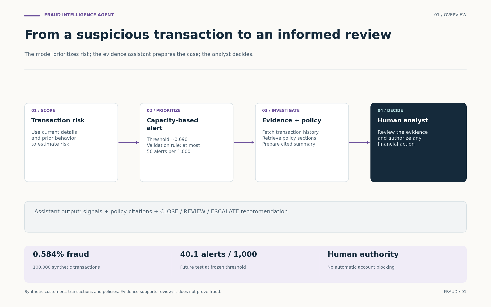
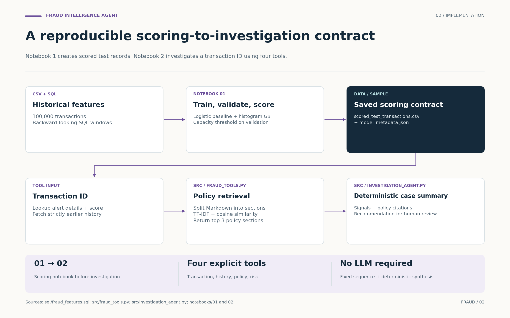
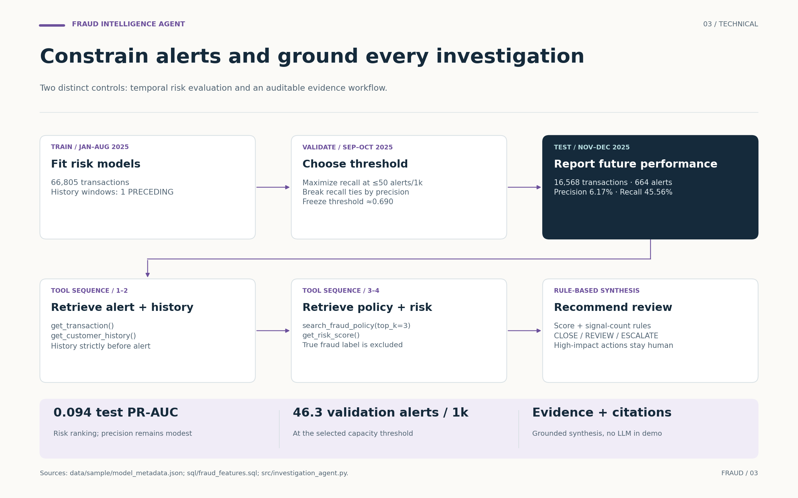

# Fraud Intelligence Agent: visual walkthrough

The risk model creates a scored transaction contract. A fixed tool sequence retrieves transaction details, earlier customer history, policy evidence and risk information, then emits a cited recommendation for an analyst.

## 01 · Overview

The model prioritizes risk; the evidence assistant prepares the case; the analyst decides.



[Editable SVG](../assets/workflows/01_overview.svg) · [PNG](../assets/workflows/01_overview.png)

## 02 · Implementation

Notebook 1 creates scored test records. Notebook 2 investigates a transaction ID using four tools.



[Editable SVG](../assets/workflows/02_implementation.svg) · [PNG](../assets/workflows/02_implementation.png)

## 03 · Technical

Two distinct controls: temporal risk evaluation and an auditable evidence workflow.



[Editable SVG](../assets/workflows/03_technical.svg) · [PNG](../assets/workflows/03_technical.png)

## Implementation notes

- The selected threshold is 0.6897766775666418 (approximately 0.690), chosen on validation to maximize recall under 50 alerts per 1,000; recall ties are broken by precision.
- The future test has 664 alerts across 16,568 transactions: 40.1 per 1,000, precision 6.17%, recall 45.56% and PR-AUC approximately 0.094. These are synthetic results with modest absolute precision.
- The current agent follows a fixed sequence. Policy retrieval is TF-IDF plus cosine similarity over Markdown sections; synthesis is deterministic. The demo does not call an LLM or vector database.
- The true fraud label is excluded from the agent-facing transaction fields. Customer-history lookup uses timestamps strictly earlier than the alert.
- CLOSE, REVIEW and ESCALATE are recommendations. requires_human_review is true for REVIEW and ESCALATE; all high-impact financial actions remain outside the tool capabilities.
- Model comparison metrics at 0.50 are distinct from the final operating metrics at the validation-selected threshold. The figures use the latter wherever an operating result is stated.

## Source map

| Figure | Repository evidence | What was checked |
|---|---|---|
| Overview | README.md; data/sample/model_metadata.json | Synthetic prevalence; validation capacity rule; final test alert workload; human decision authority |
| Implementation | notebooks/01_fraud_detection.ipynb; src/fraud_tools.py; src/investigation_agent.py | Scored CSV and metadata; four tools; TF-IDF policy retrieval; deterministic case synthesis |
| Technical | sql/fraud_features.sql; data/sample/model_metadata.json; src/investigation_agent.py | Backward-only history; chronological splits; validation threshold; fixed investigation sequence and signal-count rules |

The figures were grounded in repository commit [`9f91c63db3d8`](https://github.com/souhiab/fraud-intelligence-agent/commit/9f91c63db3d8891a2149b97cb39afc3a933a1da0). Source date: October 6, 2026. Figures are explanatory diagrams, not additional experiments.

## Files and regeneration

- `assets/workflows/`: three PNGs, three editable SVGs and one three-page PDF.
- `docs/workflow_figures.json`: labels, geometry, connections and evidence notes.
- `scripts/render_workflow_figures.py`: deterministic Matplotlib renderer using the existing project dependency.

From the repository root, run:

```bash
python scripts/render_workflow_figures.py
```

The script can also run from another directory using its absolute path. It only recreates the visual assets and does not execute or alter the research notebooks, data, models or reported metrics. Text-bound checks reject card overflow during rendering.

The shared visual language uses a warm background, dark navy decisions, project-specific accents and generous spacing. Solid connections show implemented data flow; dashed campaign-test elements mark proposed extensions. The SVG labels remain editable text.
